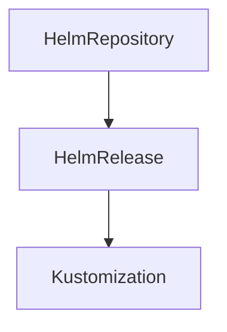

# Fleet Infra — GitOps Platform

> **Infrastructure-as-Code** for managing Kubernetes clusters, observability stack, and application workloads via Flux CD + Kustomize.

---

## Table of Contents

- [Architecture](#architecture)
- [Prerequisites](#prerequisites)
- [Quick Start](#quick-start)
- [Repository Layout](#repository-layout)
- [Flux CD Workflow](#flux-cd-workflow)
- [Infrastructure Components](#infrastructure-components)
  - [Security](#security)
  - [Networking](#networking)
  - [Observability](#observability)
  - [Logging](#logging)
- [Application Deployment](#application-deployment)
- [Cluster Targets](#cluster-targets)
- [Glossary of Tools](#glossary-of-tools)

---

## Architecture

```
┌──────────────────────────────────────────────────────────────────────┐
│                     Git Repository (Source of Truth)                  │
│                      git repo: main branch                            │
└────────────────────────┬─────────────────────────────────────────────┘
                         │ push / PR merge
                         ▼
┌──────────────────────────────────────────────────────────────────────┐
│                          Flux CD Operators                             │
│  GitRepository ──► HelmRepository ──► Kustomization ──► HelmRelease │
└──────────────────────────────────────────────────────────────────────┘
                         │ watches cluster state
                         ▼
┌──────────────────────────────────────────────────────────────────────┐
│                        Kubernetes Cluster                              │
│                                                                      │
│  ┌─────────────┐  ┌──────────────┐  ┌──────────────┐               │
│  │ Istio/Gateway│  │ cert-manager │  │  Applications │               │
│  │   (Mesh)     │  │ (TLS Certs)  │  │ (lumina NS)  │               │
│  └─────────────┘  └──────────────┘  └──────┬───────┘               │
│                                             │                        │
│                   ┌─────────────────────────┼──────────┐            │
│                   ▼                         ▼          ▼            │
│         ┌──────────────┐   ┌──────────────┐  ┌─────────────┐      │
│         │  Prometheus  │   │   Grafana    │  │   Vector/   │      │
│         │  (Metrics)   │   │  (Dashboards)│  │   Quickwit  │      │
│         └──────────────┘   └──────────────┘  │  (Logging)  │      │
│                                               └─────────────┘      │
│                                                                    │
│                   ┌────────────────────────────────────┐           │
│                   │     Weave GitOps Dashboard         │           │
│                   │   (UI — flux-system namespace)     │           │
│                   └────────────────────────────────────┘           │
└──────────────────────────────────────────────────────────────────────┘
```

---

## Prerequisites

| Tool | Purpose |
|------|---------|
| **kubectl** | Cluster access |
| **flux CLI** | Bootstrap & manage GitOps controller |
| **kustomize** | Local preview / diff of manifests |
| **Helm 3** | Install HelmReleases (cert-manager, Vector, etc.) |

### Cluster Requirements

- Kubernetes ≥ 1.28
- Istio installed (Gateway CRD support)
- `istio` as the Gateway `gatewayClassName`

---

## Quick Start

### 1. Bootstrap Flux on the Target Cluster

```bash
flux bootstrap github \
  --owner=traipoap \
  --repository=fleet-infra \
  --branch=main \
  --path=clusters/dev \
  --personal
```

### 2. Verify Flux is Watching

```bash
kubectl get pods -n flux-system
kubectl get kustomization -n flux-system
kubectl get gitrepository -n flux-system
```

### 3. Apply the Top-Level Kustomization (Sources + Infra)

The sources `Kustomization` pulls in every Helm repository, GitRepository, and infrastructure Kustomization:

```bash
# Preview locally
kustomize build sources/ > /dev/null

# Push to main branch — Flux will reconcile automatically
git add . && git commit -m "sync sources & infra" && git push
```

Flux CD will automatically:

1. Sync the Git source (`sources/git-repo.yaml`)
2. Resolve Helm repos (`vector`, `quickwit`, `nfs-provisioner`, `weave-gitops`)
3. Deploy infrastructure components (`infrastructure/`)
4. Deploy application workloads (`applications/base/`)

---

## Repository Layout

```
fleet-infra/
├── applications/               # Application workloads (Kustomize)
│   └── base/                   # Single Kustomization bundle
│       ├── namespace.yaml      # lumina namespace (Istio ambient mode)
│       ├── configmap.yaml      # Shared ConfigMap
│       ├── frontend-deployment.yaml   # Next.js app (port 4321)
│       ├── frontend-service.yaml      # ClusterIP svc → 4321
│       ├── backend-deployment.yaml    # API server (port 8080)
│       ├── backend-service.yaml       # ClusterIP svc → 8080
│       ├── gateway.yaml             # Istio Gateway — HTTP+HTTPS, TLS termination
│       ├── httproute.yaml           # Path-based routing rules
│       ├── ingress.yaml             # Legacy fallback ingress (if any)
│       ├── cert-lumina.yaml         # Certificate resource for frontend
│       └── kustomization.yaml       # Bundles all above
│
├── clusters/                 # Per-cluster overlays
│   └── dev/                  # Dev environment
│       └── flux-system/
│           ├── gotk-components.yaml   # Flux CD CRDs
│           ├── gotk-sync.yaml         # Flux sync to Git
│           └── kustomization.yaml     # Installs Flux itself
│
├── infrastructure/           # Platform components (Helm + Kustomize)
│   ├── kustomization.yaml    # Aggregates all infra subdirs
│   │
│   ├── security/             # TLS & certificate management
│   │   ├── cert-manager/
│   │   │   ├── kustomization.yaml
│   │   │   └── cert-manager-config.yaml   # ClusterIssuers (Let's Encrypt staging + self-signed)
│   │   └── kustomization.yaml
│   │
│   ├── networking/           # Storage & cluster networking
│   │   ├── kustomization.yaml
│   │   └── nfs/
│   │       ├── kustomization.yaml
│   │       └── nfs-subdir-external-provisioner-release.yaml  # NFS HelmRelease
│   │
│   ├── observability/        # Metrics & visualization
│   │   ├── kustomization.yaml
│   │   ├── prometheus/     # Prometheus for metrics collection
│   │   │   └── kustomization.yaml
│   │   ├── grafana/        # Grafana dashboards
│   │   │   └── kustomization.yaml
│   │   └ kialia/           # Kiali — Istio service mesh visualization
│   │       └── kustomization.yaml
│   │
│   └── logging/            # Log pipeline (Vector → Quickwit) + OTel comparison
│       ├── kustomization.yaml
│       ├── otel-config.yaml         # OTel Collector config for side-by-side testing
│       ├── vector/                  # Vector agent (syslog+k8s logs → Quickwit HTTP sink)
│       │   ├── kustomization.yaml
│       │   ├── values.yaml          # Custom Vector remap pipeline
│       │   └── vector-release.yaml  # HelmRelease CRD
│       └── quickwit/            # Quickwit (distributed search & log store)
│           ├── kustomization.yaml
│           ├── quickwit-release.yaml    # Indexer + searcher deployment
│           ├── quickwit-indexer.yaml
│           ├── job-create-index.yaml    # Index schema job
│           └── temp.yaml
│
└── sources/                # Flux Sources (GitRepos + HelmRepos)
    ├── kustomization.yaml  # Aggregates all sources
    ├── git-repo.yaml       # Self-referencing GitRepo + Kustomization for apps
    ├── vector-repo.yaml    # Vector Helm repo (oci://helm.vector.dev)
    ├── quickwit-repo.yaml  # Quickwit Helm repo
    ├── nfs-repo.yaml       # NFS provisioner Helm repo
    └── weave-gitops-dashboard.yaml  # Weave GitOps Dashboard HelmRelease (UI)
```

---

## Flux CD Workflow

This project uses the **Helm + Kustomize** hybrid pattern:

### Layer 1 — Source of Truth (Git)

| Resource | Purpose | File |
|----------|---------|------|
| `GitRepository` | Points Flux to this repo | `sources/git-repo.yaml` |
| `HelmRepository` (OCI) | Weave GitOps chart source | `weave-gitops-dashboard.yaml` |
| `HelmRepository` (URL) | Vector, Quickwit, NFS charts | `vector-repo.yaml`, `quickwit-repo.yaml`, `nfs-repo.yaml` |

### Layer 2 — Infrastructure Deployment

```
sources/kustomization.yaml
    │
    ├── infrastructure/           ← Kustomize applies all infra manifests
    │       ├── security/         → cert-manager ClusterIssuers
    │       ├── networking/nfs/   → NFS provisioner HelmRelease
    │       ├── observability/    → Prometheus, Grafana, Kiali
    │       └── logging/          → Vector + Quickwit HelmReleases
    │
    └── vector-repo.yaml ...      ← Helm repositories for resolution
```

### Layer 3 — Application Deployment

```
sources/git-repo.yaml (Kustomization: "app")
    │
    path: ./applications/base
    prune: true                   # Removes resources no longer in Git
    wait: true                    # Waits for all resources to be ready
    targetNamespace: lumina       # Applies into the lumina namespace
```

### Layer 4 — GitOps Dashboard (Optional UI)

```
sources/weave-gitops-dashboard.yaml
    │
    HelmRelease: weave-gitops
    Namespace: flux-system
    Admin user: admin
    URL: /weave/gitops/             # After ingress setup
```

---

## Infrastructure Components

### Security

#### Cert-Manager + ClusterIssuers

| Issuer | Purpose | Environment |
|--------|---------|-------------|
| `letsencrypt-prostaging` | ACME staging (sandboxed) | Development / testing TLS issuance |
| `selfsigned-issuer` | Self-signed certs for dev | Local development, non-production |

**File**: `infrastructure/security/cert-manager/cert-manager-config.yaml`

The Gateway (`applications/base/gateway.yaml`) references the ClusterIssuer via annotation:
```yaml
annotations:
  cert-manager.io/cluster-issuer: "letsencrypt-prod"
```

### Networking

#### NFS Subdir External Provisioner

| Item | Value |
|------|-------|
| HelmChart | `nfs-subdir-external-provisioner` |
| Source | `sources/nfs-repo.yaml` |
| Purpose | Dynamic PersistentVolume provisioning via NFS |

### Observability Stack

#### Prometheus

Metrics collection from application pods. Annotations on deployments enable auto-scraping:

```yaml
annotations:
  prometheus.io/scrape: "true"
  prometheus.io/port: "4321"   # or "8080" for backend
```

#### Grafana

Dashboards for visualizing Prometheus metrics.

#### Kiali (Kialia)

Istio service mesh visualization — maps topology, traffic flow, and security policies across the mesh.

### Logging Pipeline

Two parallel log collection agents are configured for **side-by-side comparison**:

#### Vector (Primary — HTTP sink to Quickwit)

| Item | Value |
|------|-------|
| Role | Agent (daemonset) |
| Sources | `syslog_tcp`, `syslog_udp` (port 514), `kubernetes_logs` |
| Transform | Remap pipeline adding `.index_timestamp` for indexing |
| Sink | `quickwit_logs` — HTTP POST → `http://quickwit-searcher:7280/api/v1/syslogs/ingest` |
| Port | API on `127.0.0.1:8686` |

#### OpenTelemetry Collector (Alternative — OTLP sink to Quickwit)

| Item | Value |
|------|-------|
| Mode | DaemonSet |
| Receiver | `file_log` — reads `/var/log/pods/**/*.log` directly |
| Exporter | `otlp` → `quickwit-indexer:7281` with disk-backed buffer |
| Purpose | Benchmark / comparison against Vector pipeline |

**Configuration**: `infrastructure/logging/otel-config.yaml`

#### Quickwit (Log Store & Search)

Distributed search engine powering log queries. Components deployed via HelmRelease:

- **Indexer** — receives logs, maintains indices
- **Searcher** — query endpoint (`port 7280`)
- **Job** — creates initial index schema on startup

---

## Application Deployment

### Frontend (Next.js)

| Property | Value |
|----------|-------|
| Image | `ghcr.io/traipoap/frontend:0.0.7` |
| Port | 4321 |
| Replica | 1 |
| Resources | Req: 64 Mi / 50 m · Lim: 128 Mi / 200 m |
| Routing | `frontend.codezap.win/*` → frontend-svc:4321 |

### Backend (API Server)

| Property | Value |
|----------|-------|
| Image | `ghcr.io/traipoap/backend:0.0.13` |
| Port | 8080 |
| Replica | 1 |
| Resources | Req: 64 Mi / 50 m · Lim: 256 Mi / 200 m |
| Endpoints | `/api/auth/login`, `/api/indices`, `/api/search` → backend-svc:8080 |

### Routing Rules (`applications/base/httproute.yaml`)

```
frontend.codezap.win/
    ├── /*              → frontend-svc:4321        (static site)
    ├── /api/auth/login → backend-svc:8080          (auth)
    ├── /api/indices    → backend-svc:8080          (index mgmt)
    └── /api/search     → backend-svc:8080          (search API)
```

All routes terminate at the **Istio Gateway** (`frontend-gateway`) with TLS via `cert-manager` auto-certificate issuance.

---

## Cluster Targets

| Cluster | Path | Flux Sync Dir | Purpose |
|---------|------|---------------|---------|
| Dev | `clusters/dev/flux-system/` | `.flux-clusters/dev` | Development / staging |

To add a new cluster, create a parallel directory under `clusters/`:

```
clusters/staging/flux-system/    # Bootstrap manifests for staging
clusters/prod/flux-system/       # Bootstrap manifests for production
```

Then run:
```bash
flux bootstrap github \
  --owner=traipoap \
  --repository=fleet-infra \
  --path=clusters/staging \
  --target-affinity="environment: staging"
```

---

## Glossary of Tools

| Tool | Role in This Project |
|------|---------------------|
| **Flux CD** | GitOps controller — syncs Git state to Kubernetes |
| **Kustomize** | Manifest templating & overlay system (no Helm values for apps) |
| **Helm 3** | Package manager for platform CRDs (Vector, Quickwit, cert-manager) |
| **Istio** | Service mesh — Gateway API class, mTLS, traffic management |
| **cert-manager** | Automated TLS certificate provisioning via ACME |
| **Vector** | Log shipper (primary pipeline) |
| **OpenTelemetry Collector** | Log collector (comparison pipeline) |
| **Quickwit** | Distributed log search & storage engine |
| **Prometheus** | Metrics collection & alerting |
| **Grafana** | Dashboard visualization |
| **Weave GitOps Dashboard** | Web UI for monitoring GitOps state |

---

## Maintenance Checklist

- [ ] Rotate cert-manager ACME email before production migration
- [ ] Replace `letsencrypt-staging` with production (`acme-v02.api.letsencrypt.org`)
- [ ] Review Vector remap pipeline (`.index_timestamp` nanosecond format) for Quickwit compatibility
- [ ] Pin Helm chart versions instead of using latest tags
- [ ] Add pod disruption budgets for infra components in production
- [ ] Configure notification channels (Slack/Email) via Flux `Alert` resources



